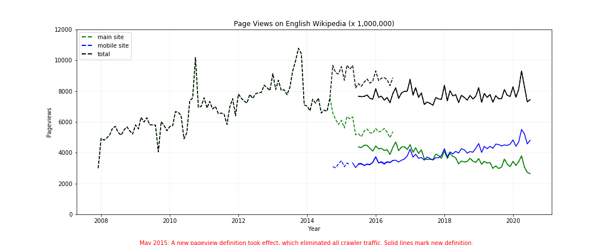

# A1 DATA CURATION

#### PROJECT GOALS
The goal of this project is to construct, analyze, and publish a dataset of monthly traffic on English Wikipedia from January 1, 2008 through August 30, 2020.  All extraction and manipulation is found in the file `A1_Data_Curation.ipynb`.

#### DATA SOURCES
All data has been pulled from the Wikimedia REST API under the  Creative Commons Attribution-ShareAlike License.
https://en.wikipedia.org/wiki/Wikipedia:Text_of_Creative_Commons_Attribution-ShareAlike_3.0_Unported_License

Usage follows the terms and conditions outlined by the Wikimedia foundation:
https://www.mediawiki.org/wiki/REST_API#Terms_and_conditions.

Both the Pageview and Legacy Pagecounts APIs were referenced in this work.   The documenation for each API endpoint can be found here:
https://wikitech.wikimedia.org/wiki/Analytics/AQS/Legacy_Pagecounts

https://wikitech.wikimedia.org/wiki/Analytics/AQS/Pageviews

#### SPECIAL CONSIDERATIONS
The Legacy Pagecounts API contains data from data from December 2007 through July 2016.  The more recent Pageviews API contains data from July 2015 through the previous month.  Both of these endpoints were used, and the data was combined between them.   There is a one-year overlap between the two sources, and this was accounted for in the analysis.

The newer version of the API excludes web crawler traffic.   This is outlined in the jupyter notebook.

#### FINAL PRODUCT
The code in this notebook creates an aggregated .csv named, _en-wikipedia_traffic_200712-202008.csv_ with the following columns:

| Column                  |    Format     |
|-------------------------|:-------------:|
| year                    |  YYYY         | 
| month                   |  MM           | 
| pagecount_all_views     | integer       | 
| pagecount_desktop_views | integer       | 
| pagecount_mobile_views  | integer       | 
| pageview_all_views      | integer       | 
| pageview_desktop_views  | integer       | 
| pageview_mobile_views   | integer       | 

It uses this data to produce the following visualization:

