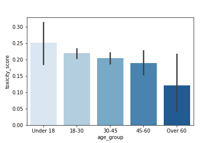

# A2 BIAS IN DATA
Karl Stavem

---
#### SUMMARY
The purpose of this exploration is to identify potential sources of bias in a corpus of human-annotated data, and describe some implications of those biases. Specifically, this analysis attempts to answer the question, "How consistent are the labeling behaviors among workers with different demographic profiles?" in regards to two separate Wikimedia datasets:

1. Toxicity
2. Aggression

Each of these datasets cover 100k talk page diffs (with 10 judgements per diff).

___
#### FINAL PRODUCT
This analysis finds significant variance in the labeling behvaior based on demographic factors.   In particular, age is found to be the most significant driver in labeling behvaior.  Graphs similar to the one below are generated to illustrate this relationship.

---

#### DATA SOURCES
All data is available at:
https://figshare.com/projects/Wikipedia_Talk/16731

RELATED LINKS:  
* Overview of the project: https://meta.wikimedia.org/wiki/Research:Detox
* Overview of the data: https://meta.wikimedia.org/wiki/Research:Detox/Data_Release
* Google's Perpective API:  https://conversationai.github.io/

All data has been pulled from  Wikimedia under the  Creative Commons Attribution-ShareAlike License.
https://en.wikipedia.org/wiki/Wikipedia:Text_of_Creative_Commons_Attribution-ShareAlike_3.0_Unported_License